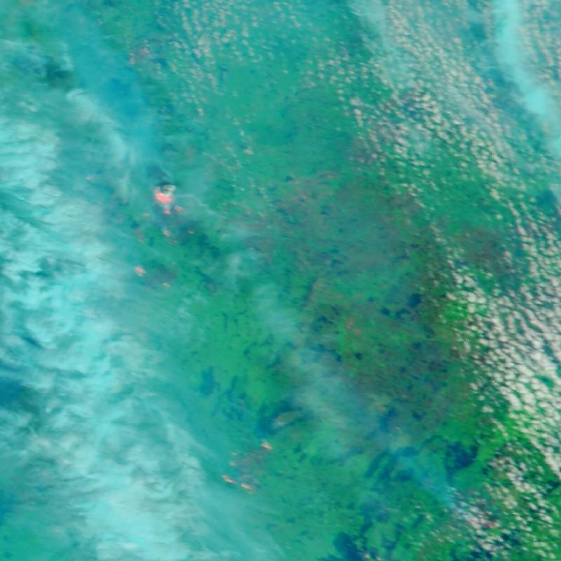
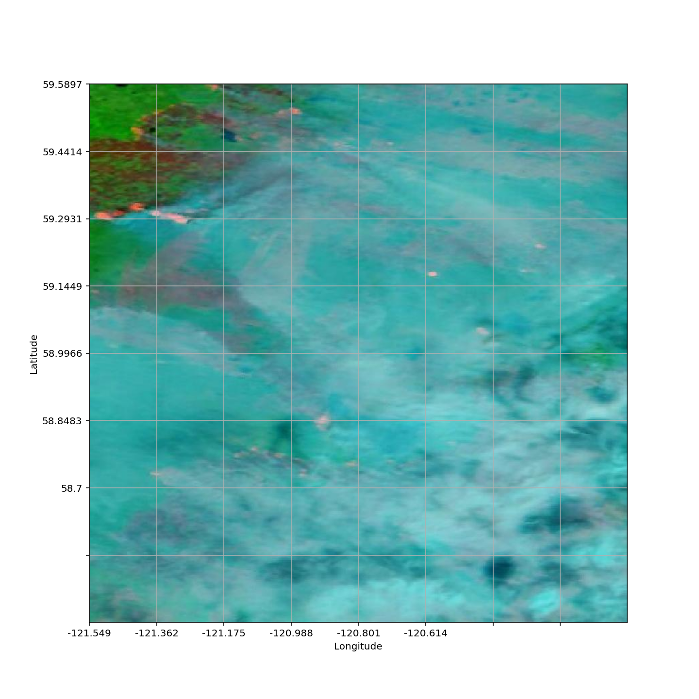
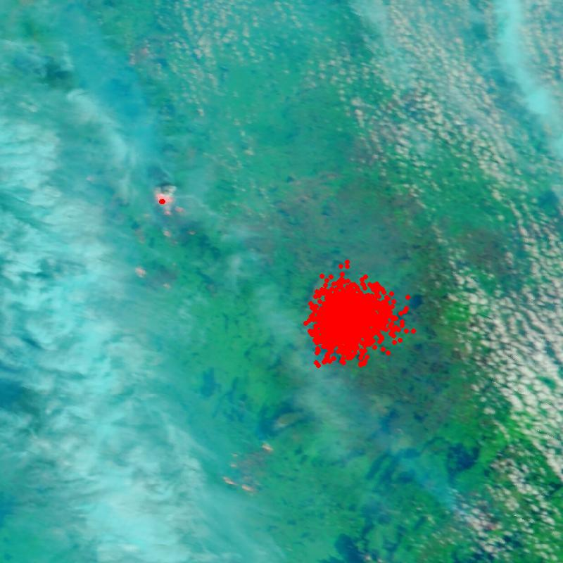

# 🔥 Wildfire Detection and Tracking System

An image-based wildfire detection, tracking, and fire-spread visualization system that combines satellite imagery, machine learning, deep learning, coordinate-based tracking, and a graphical user interface.

---

## 📌 Project Overview

The **Wildfire Detection and Tracking System** is designed to detect fire from satellite images and visualize the detected fire pattern and potential spread.

The system accepts:

- Latitude 1
- Longitude 1
- Latitude 2
- Longitude 2
- Date

It retrieves a satellite image for the selected geographical region and date, performs fire classification, applies object detection, and generates fire-spread visualizations.

The main application is implemented using a **Tkinter GUI**.

---

## 🎯 Objectives

- Detect fire from satellite imagery.
- Retrieve satellite images using geographical coordinates and date.
- Classify an image as **Fire Detected** or **No Fire Detected**.
- Perform fire detection using a YOLO-based detection stage.
- Track/predict fire locations using coordinate data.
- Visualize predicted fire patterns on the map.
- Simulate potential fire spread using environmental parameters.
- Generate visual outputs for analysis and tracking.

---

## 🚀 System Workflow

```text
User Input
   │
   ├── Latitude 1
   ├── Longitude 1
   ├── Latitude 2
   ├── Longitude 2
   └── Date
        │
        ▼
NASA Satellite Image Retrieval
        │
        ▼
Input Satellite Image
        │
        ▼
SVM-Based Fire Classification
        │
        ├── No Fire Detected
        │       └── Process Ends
        │
        └── Fire Detected
                │
                ▼
          YOLO Fire Detection
                │
                ▼
       Detected Fire Image
                │
                ▼
       Fire Spread Prediction
                │
                ▼
      Future Fire Visualization
                │
                ▼
       Tracking / Map Outputs
```

---

# 🧠 Technologies Used

| Technology | Purpose |
|---|---|
| Python | Main programming language |
| Tkinter | Graphical User Interface |
| NumPy | Numerical processing |
| Pandas | Data processing |
| Matplotlib | Data visualization |
| Scikit-learn | Data preprocessing and evaluation |
| TensorFlow / Keras | Deep learning models |
| SVM Model | Initial fire classification |
| YOLO | Fire object detection |
| LSTM | Fire-status prediction/tracking |
| PIL / Pillow | Image processing |
| OpenCV | Image processing |
| NASA Earthdata | Satellite image retrieval |
| CSV | Coordinate data storage |

---

# 🛰️ Satellite Image Retrieval

The system retrieves satellite imagery using the NASA Worldview / Earthdata snapshot API.

The input consists of:

- Date
- First/upper-left coordinate
- Second/lower-right coordinate

The downloaded image is stored as:

```text
Input_map.jpg
```

---

# 🔍 Fire Classification

The first detection stage uses a trained Keras model stored as:

```text
model/svm_final.h5
```

The input image is:

1. Loaded
2. Resized to `224 × 224`
3. Converted to an array
4. Normalized by dividing pixel values by 255
5. Passed to the trained model

The model produces:

```text
Fire Detected
```

or

```text
No Fire Detected
```

---

# 🎯 YOLO Fire Detection

If the classification stage identifies fire, the system proceeds to the YOLO detection stage.

The detected image is generated as:

```text
Yolo_Detected.jpg
```

After successful YOLO detection, the system proceeds to the fire-spread visualization stage.

---

# 📍 Fire Pattern Prediction

The system uses coordinate information to generate a fire-pattern visualization.

`MapInit.py` processes coordinate information from:

```text
predicted_Cord.csv
```

and creates the fire-pattern image:

```text
Fire_Pattern_Predicted.png
```

---

# 🌡️ Fire Spread Prediction

The project contains a fire-spread simulation implemented in:

```text
FireSpreadModel.py
```

The implemented spread-rate calculation uses:

- Temperature
- Wind speed
- Humidity

The formula used in the current implementation is:

```python
rate = (temp * 0.03) + (wind_speed * 0.05) - (humidity * 0.02)
```

A minimum spread rate of `1` is applied.

The simulation also considers wind direction:

```text
E → East
W → West
N → North
S → South
```

The current implementation generates a five-day simulation and saves:

```text
Future_Fire_Spread.jpg
```

> **Note:** This component is a simulation based on the implemented formula and parameters. It should not be interpreted as a validated physical fire-behavior or operational forecasting model.

---

# 🧠 LSTM-Based Prediction

The project includes an LSTM neural-network component.

The architecture contains multiple LSTM layers followed by Dense layers:

```text
LSTM (20 units)
      ↓
Dropout
      ↓
LSTM (40 units)
      ↓
Dropout
      ↓
LSTM (80 units)
      ↓
Dropout
      ↓
LSTM (80 units)
      ↓
Dropout
      ↓
Dense (40)
      ↓
Dense (1)
```

The trained weights are loaded from:

```text
model/LSTMModelData.h5
```

The LSTM component uses `MinMaxScaler` for preprocessing and calculates Root Mean Square Error (RMSE) during evaluation.

---

# 🗺️ Fire Tracking

The LSTM processing generates coordinate information and stores it in:

```text
predicted_Cord.csv
```

These coordinates are used by the map-processing component to generate fire-pattern visualizations.

Sequential result frames can also be combined into:

```text
LSTM_output.gif
```

---

# 📊 Project Results

## 1. Input Satellite Image

The system retrieves the satellite image according to the entered coordinates and date.



---

## 2. Fire Pattern Prediction

The system visualizes predicted fire locations on the map.



---

## 3. Future Fire Spread

The fire-spread simulation generates future fire points based on the implemented environmental parameters.



---

## 4. YOLO Detection

The YOLO stage produces:

```text
Yolo_Detected.jpg
```

---

## 5. LSTM Tracking Output

The LSTM processing generates sequential result frames and combines them into:

```text
LSTM_output.gif
```

---

# 📁 Project Structure

```text
Wildfire-Detection-and-Tracking-System/
│
├── README.md
│
├── MAINGUI.py
├── ImageMapPulling.py
├── SVM_Test.py
├── FireSpreadModel.py
├── MapInit.py
├── preprocessing.py
├── Test_Processing.py
├── imageopen.py
│
├── WF_YOLO_02.ipynb
├── email_alert.ipynb
│
├── model/
│   ├── svm_final.h5
│   ├── LSTMModelData.h5
│   └── best.pt
│
├── data/
│   └── predicted_Cord.csv
│
├── outputs/
│   ├── Input_map.jpg
│   ├── Fire_Pattern_Predicted.png
│   ├── Future_Fire_Spread.jpg
│   ├── Yolo_Detected.jpg
│   └── LSTM_output.gif
│
└── docs/
    └── Input-coordinates.docx
```

---

# 🖥️ Graphical User Interface

The application uses Tkinter to provide a simple interface.

The user enters:

```text
Latitude 1
Longitude 1
Latitude 2
Longitude 2
Date
```

and clicks:

```text
SUBMIT
```

The application then starts the processing workflow.

---

# 📥 Sample Input Data

Example coordinate records:

| Latitude 1 | Longitude 1 | Latitude 2 | Longitude 2 | Result | Date |
|---:|---:|---:|---:|---|---|
| 39.7789 | -121.76168 | 41.188645 | -120.327158 | Fire | 2024-07-28 |
| 35.785 | -121.044833 | 37.768653 | -117.327158 | No Fire | 2024-07-27 |
| 58.7 | -121.736 | 59.738 | -120.614 | Fire | 2024-07-09 |
| 44.12 | -120.195 | 44.522 | -119.688 | Fire | 2024-08-04 |

---

# ⚙️ Installation

## 1. Clone the repository

```bash
git clone https://github.com/YOUR_USERNAME/Wildfire-Detection-and-Tracking-System.git
cd Wildfire-Detection-and-Tracking-System
```

## 2. Install required packages

```bash
pip install numpy pandas matplotlib pillow opencv-python tensorflow keras scikit-learn
```

Additional packages required by individual project files may need to be installed according to their imports.

---

# ▶️ How to Run

Run the main GUI:

```bash
python MAINGUI.py
```

Enter:

```text
Latitude 1
Longitude 1
Latitude 2
Longitude 2
Date
```

Then click:

```text
SUBMIT
```

The application retrieves the satellite image and starts the detection workflow.

---

# 🔄 Complete Processing Pipeline

```text
             USER INPUT
                 │
                 ▼
      Latitude / Longitude / Date
                 │
                 ▼
       NASA Satellite Image
                 │
                 ▼
       Image Preprocessing
                 │
                 ▼
        SVM Fire Classification
                 │
        ┌────────┴─────────┐
        │                  │
     No Fire            Fire
        │                  │
      STOP                 ▼
                    YOLO Detection
                           │
                           ▼
                    Fire Detection
                           │
                           ▼
                 Fire Spread Prediction
                           │
                           ▼
                 Map / Pattern Output
                           │
                           ▼
                   LSTM Tracking
                           │
                           ▼
                    Result Images
```

---

# 📌 Main Files

### `MAINGUI.py`
Controls the main Tkinter interface and connects the different processing stages.

### `ImageMapPulling.py`
Retrieves the satellite image using the NASA Earthdata snapshot API.

### `SVM_Test.py`
Loads the trained classification model and determines whether fire is detected.

### `FireSpreadModel.py`
Generates a simulated future fire-spread visualization.

### `MapInit.py`
Processes coordinate data and creates fire-pattern visualizations.

### `Test_Processing.py`
Contains the LSTM-based prediction and tracking workflow.

### `preprocessing.py`
Performs data preprocessing.

---

# 🔬 Machine Learning Components

| Component | Role |
|---|---|
| SVM Classification Model | Initial fire / no-fire classification |
| YOLO | Fire detection stage |
| LSTM | Fire-status prediction and tracking |
| Coordinate Processing | Fire-pattern visualization |
| Fire Spread Simulation | Future spread visualization |

---

# 📈 Evaluation

The LSTM component evaluates predictions using **Root Mean Square Error (RMSE)**.

```python
lstmtestScore = math.sqrt(
    mean_squared_error(test_Y, predicted_fire_status)
)
```

The RMSE value is printed during execution.

---

# 🌟 Key Features

- 🛰️ Satellite image retrieval
- 📍 Coordinate-based geographical input
- 🔥 Fire / No-Fire classification
- 🎯 YOLO-based detection
- 🗺️ Fire pattern visualization
- 🌡️ Temperature-based spread simulation
- 💨 Wind-direction and wind-speed consideration
- 💧 Humidity consideration
- 🧠 LSTM-based prediction
- 📊 RMSE evaluation
- 🎞️ Sequential fire-tracking visualization
- 🖥️ Tkinter graphical interface

---

# 🔮 Future Scope

- Integrate real-time satellite imagery.
- Improve fire detection accuracy using a larger dataset.
- Use geographically calibrated coordinates for spread visualization.
- Incorporate additional weather and environmental variables.
- Improve fire-spread modelling using validated fire-behavior models.
- Improve the GUI and visualization interface.
- Add automated alert and notification functionality.
- Deploy the system as a web-based application.
- Add historical fire-analysis dashboards.
- Improve real-time tracking capabilities.

---

# ⚠️ Limitations

- The fire-spread component currently uses a simulation formula rather than a validated physical fire-spread model.
- The supplied implementation uses fixed environmental values in `FireSpreadModel.py`.
- The spread simulation includes random movement, so repeated executions can produce different point patterns.
- Model performance depends on the training data and trained model weights.
- Satellite imagery availability depends on the requested date, coordinates, and external NASA service availability.

---

# 👩‍💻 Author

**Sanika Jagtap**

Computer Engineering | Data Science & Machine Learning

---

# 📄 Project Type

**Academic / Final Year Engineering Project**

**Domain:** Machine Learning | Deep Learning | Computer Vision | Satellite Image Processing | Wildfire Detection | Fire Tracking
